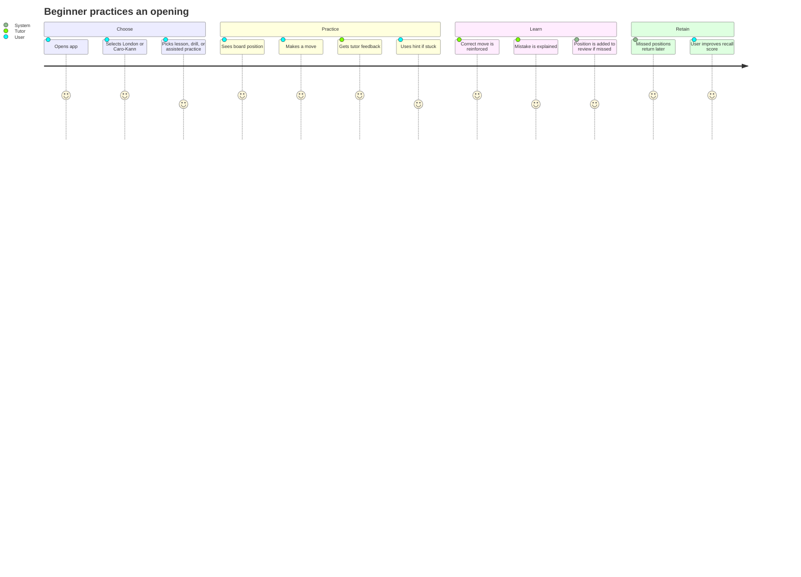
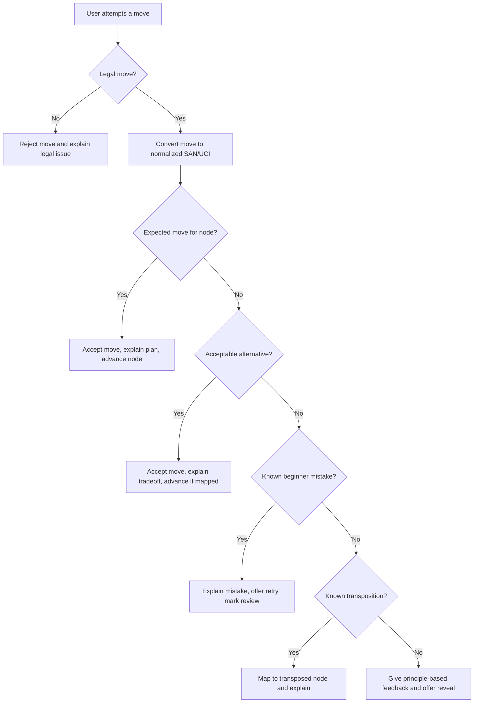
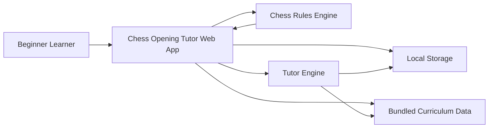
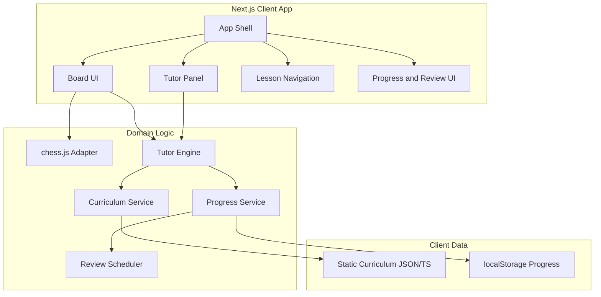
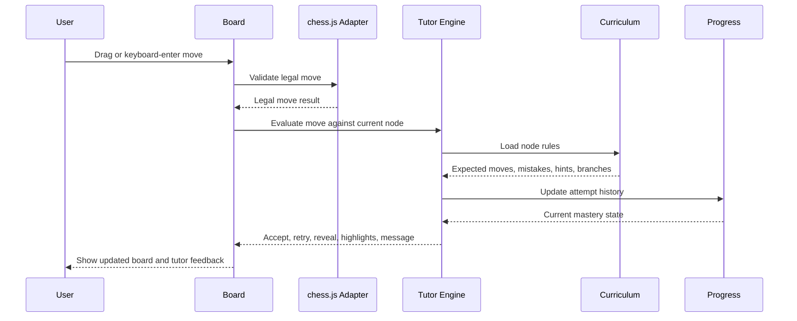
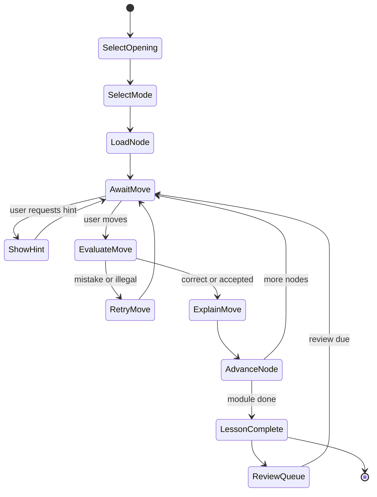
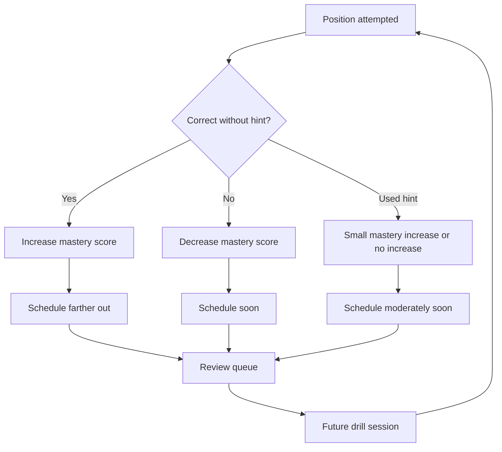
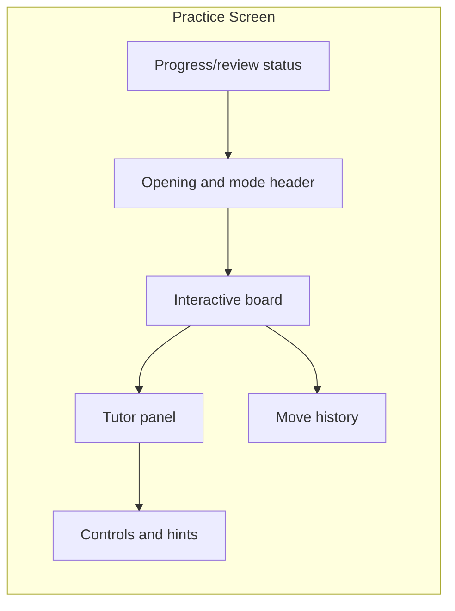
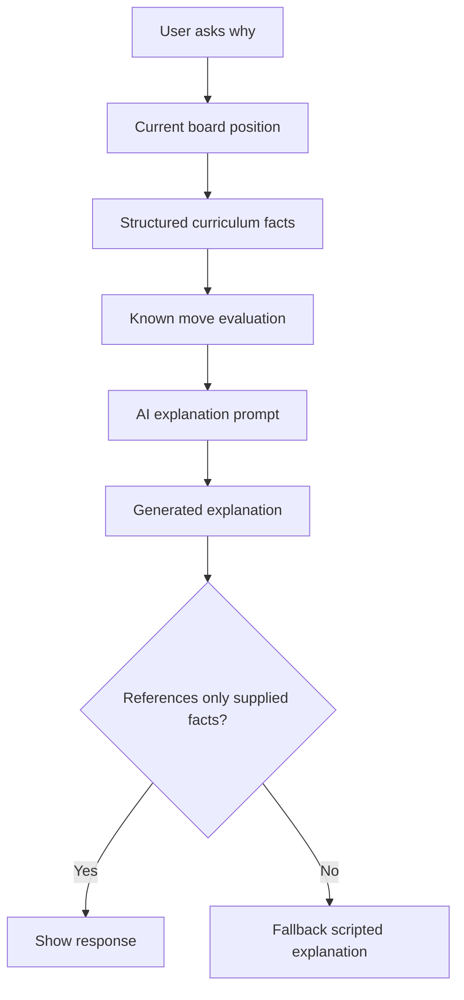

# Chess Opening Tutor PRD

Status: Draft v1  
Date: 2026-06-30  
Owner: Alexander Olomokoro  
Product type: Local-first web app for beginner chess opening practice

## 1. Executive Summary

Chess Opening Tutor is an interactive web app that teaches a beginner two opening repertoires: the London System as White and the Caro-Kann as Black. The product solves a specific learning failure: watching opening videos does not create reliable recall during actual games.

Instead of presenting openings as passive lessons or dense theory tables, the app teaches by making the user play moves on a chessboard. A tutor panel gives immediate, position-aware guidance: what to move, why it matters, what mistake was made, and how the plan changes when the opponent leaves the expected line.

V1 is a personal, free, local-first app. It has no accounts, no backend, no paid services, and no AI dependency. AI tutoring is planned as a later layer over trusted structured curriculum data.

## 2. Problem Statement

Beginner chess learners often consume opening content passively. A common pattern is:

1. Watch a YouTube video about an opening.
2. Recognize a few move sequences immediately after watching.
3. Play a real game on chess.com or Lichess.
4. Face a move order or variation that differs from the video.
5. Forget the line, lose confidence, and abandon the opening plan.

The root issue is not only memory. The learner lacks retrieval practice, position recognition, and plan-based recovery.

Chess Opening Tutor addresses this by making the opening study session feel like playing chess with a coach beside the board.

## 3. Goals

### Product Goals

- Teach the London System and Caro-Kann through board-first practice.
- Help the user remember moves by repeatedly retrieving them in context.
- Explain the purpose of each move in beginner-friendly language.
- Recognize common opponent replies and transpositions.
- Save mistakes locally and resurface them through review.
- Keep the app free to build and free to use for v1.

### Learning Goals

The user should learn:

- The core London System setup and why the setup works.
- The main Caro-Kann starting structure and common White third moves.
- How to think when the opponent deviates.
- Which mistakes they repeat and how to correct them.
- The difference between memorized move order and reusable opening plan.

### Engineering Goals

- Use stable, well-supported open-source libraries.
- Keep v1 fully client-side.
- Make curriculum data structured, testable, and easy to extend.
- Separate chess rules, tutor decisions, UI state, and progress storage.
- Build the product so an AI tutor can be added later without replacing the core tutor engine.

## 4. Non-goals

V1 will not include:

- User accounts or cloud sync.
- Multiplayer or live opponent matching.
- Paid APIs or required subscriptions.
- Full engine analysis for every move.
- Full opening encyclopedias.
- Advanced chess notation study as the primary interface.
- AI-generated chess advice as the source of truth.
- Native mobile apps.

## 5. Target Users

### Primary Persona: Beginner Repertoire Builder

- Skill level: beginner to early intermediate.
- Pain: forgets openings after watching videos.
- Need: practice the opening by playing the move.
- Motivation: feel confident entering familiar structures in real games.
- Success signal: can play first 6-10 moves of common lines with understanding.

### Secondary Persona: Returning Casual Player

- Skill level: rusty intermediate.
- Pain: knows chess basics but lacks a reliable opening routine.
- Need: simple repertoire and quick review queue.
- Motivation: stop losing games from confused early move choices.

## 6. Scope

### V1 Scope

V1 includes:

- Interactive chessboard.
- London System module for White.
- Caro-Kann module for Black.
- Guided lesson mode.
- Drill mode.
- Assisted opening practice mode.
- Local progress storage.
- Review queue for missed positions.
- Selectable tutor style.
- Accessible keyboard-friendly board interactions.

### Later Scope

Later releases may include:

- AI explanation layer.
- Real game import from PGN.
- Lichess/chess.com game review workflows.
- Stockfish-backed post-opening evaluation.
- Cloud sync.
- Public deployment.
- Community-created curriculum packs.

## 7. Product Experience

### Primary User Journey



### Core Modes

#### Guided Lesson Mode

Guided Lesson Mode teaches one concept at a time. The tutor introduces a position, asks the user to make a move, then explains the move after the user acts.

Requirements:

- Lessons must be short and board-centered.
- Each lesson must have a clear concept, such as "develop the bishop before closing the pawn chain."
- The user must make moves manually.
- Hints should be progressive, not all-or-nothing.

#### Drill Mode

Drill Mode tests recall. The user sees a known position and must find the correct move with minimal instruction.

Requirements:

- Positions should come from the active opening module and review queue.
- Feedback should be faster than in guided lessons.
- Missed positions should update progress and return later.
- Drills should include transposed positions once the user has learned the base pattern.

#### Assisted Practice Mode

Assisted Practice Mode simulates the opening phase of a game. The app plays opponent responses and the user plays their repertoire side.

Requirements:

- The app should choose common opponent replies.
- The tutor should stay visible but not interrupt every correct move with long explanations.
- If the user makes a wrong move, the app should explain and offer retry/reveal options.
- If a position exits the known curriculum, the tutor should switch to principle-based guidance.

## 8. Opening Curriculum

### London System Curriculum

The London System should be taught as a setup and plan, not only a move order.

Core setup:

- White pawn on d4.
- Knight on f3.
- Bishop on f4 before e3.
- Pawn on e3.
- Bishop often to d3.
- Knight often to d2.
- Pawn often to c3.
- White castles kingside.

Required London concepts:

- Why Bf4 is developed outside the pawn chain.
- How the London setup remains usable across many Black replies.
- When to play c3 versus c4.
- Why Ne5 is a common attacking and centralizing idea.
- How to respond to early ...Bf5.
- How to respond to ...g6 setups.
- How to respond to early ...c5 pressure.
- How to avoid autopilot moves when Black challenges the center.

Minimum V1 London branches:

| Branch | Example Start | Teaching Focus |
| --- | --- | --- |
| Classical London | 1.d4 d5 2.Nf3 Nf6 3.Bf4 | Core setup and development |
| Early Bf4 | 1.d4 d5 2.Bf4 | Flexible move order |
| King's Indian setup | 1.d4 Nf6 2.Nf3 g6 3.Bf4 | Keep setup, respect bishop pressure |
| Early ...c5 | 1.d4 Nf6 2.Nf3 c5 | Center tension and c3/c4 choice |
| Symmetric bishop | 1.d4 d5 2.Bf4 Bf5 | Avoid passive copying, develop naturally |

### Caro-Kann Curriculum

The Caro-Kann should be taught as Black's reliable response to 1.e4.

Core starting position:

```text
1. e4 c6 2. d4 d5
```

Required Caro-Kann concepts:

- Why Black supports ...d5 with ...c6.
- Why the light-square bishop often develops before ...e6.
- How Black challenges White's center with ...c5 or ...e6 at the right time.
- Why the Caro-Kann is solid but should not become passive.
- How to recognize White's third move and choose the correct plan.

Minimum V1 Caro-Kann branches:

| Branch | Example Start | Teaching Focus |
| --- | --- | --- |
| Advance Variation | 1.e4 c6 2.d4 d5 3.e5 | Develop ...Bf5 before ...e6 |
| Exchange Variation | 1.e4 c6 2.d4 d5 3.exd5 cxd5 | Symmetrical structure and development |
| Classical Variation | 1.e4 c6 2.d4 d5 3.Nc3 | Main development and central tension |
| Modern/Classical via Nd2 | 1.e4 c6 2.d4 d5 3.Nd2 | Similar structure, move-order awareness |
| Fantasy Variation | 1.e4 c6 2.d4 d5 3.f3 | Strike the center carefully |
| Panov-Botvinnik | 1.e4 c6 2.d4 d5 3.exd5 cxd5 4.c4 | Isolated queen pawn themes |

## 9. Scripted Tutor System

"Scripted tutor" means the tutor does not guess. It uses structured chess curriculum data attached to positions and move outcomes.

The tutor engine receives:

- Current board position.
- Side the user is training.
- User move.
- Active lesson or drill context.
- Known curriculum nodes.
- Local progress history.

The tutor returns:

- Feedback type.
- Tutor message.
- Highlighted squares or arrows.
- Whether the move should be accepted.
- Whether the user should retry.
- Whether the position should be added to review.
- Next curriculum node or next opponent move.

### Tutor Decision Flow



### Feedback Types

| Type | Meaning | Example |
| --- | --- | --- |
| correct | User played the target move | "Good. Bf4 gets your bishop outside the pawn chain." |
| acceptable | Move is playable but not the training target | "This can be played, but this lesson is training the London setup." |
| mistake | Move matches a known error | "Playing ...e6 now traps your c8 bishop." |
| illegal | Move is not legal | "That knight cannot move there from this position." |
| transposition | Move order changed but position is known | "Different order, same London structure." |
| principle | Position is outside curriculum | "You are out of the lesson line. Develop, castle, and challenge the center." |

### Hint Ladder

Hints should progress from conceptual to explicit:

1. Concept hint: "Your light-square bishop has a job before the pawn chain closes."
2. Region hint: highlight the bishop and likely target square.
3. Move hint: "Play ...Bf5."
4. Explanation after reveal: why the move matters.

### Example Tutor Node

```ts
type CurriculumNode = {
  id: string;
  opening: "london" | "caro-kann";
  variationId: string;
  fen: string;
  sideToMove: "w" | "b";
  userSide: "w" | "b";
  expectedMoves: TutorMove[];
  acceptableMoves: TutorMove[];
  mistakes: MistakePattern[];
  hints: string[];
  explanation: string;
  conceptTags: string[];
  next: BranchRule[];
};
```

Example content:

```ts
{
  id: "caro-advance-003",
  opening: "caro-kann",
  variationId: "advance",
  fen: "position after 1.e4 c6 2.d4 d5 3.e5",
  sideToMove: "b",
  userSide: "b",
  expectedMoves: [
    {
      san: "Bf5",
      uci: "c8f5",
      message: "Good. In the Advance Caro-Kann, the bishop comes out before ...e6."
    }
  ],
  acceptableMoves: [
    {
      san: "c5",
      uci: "c6c5",
      message: "This immediately challenges the center, but this lesson is training the bishop-first plan."
    }
  ],
  mistakes: [
    {
      san: "e6",
      tag: "locked_light_square_bishop",
      message: "Legal, but it locks your c8 bishop behind the pawn chain. Try ...Bf5 first."
    }
  ],
  hints: [
    "Before closing the pawn chain, look at your c8 bishop.",
    "Develop the light-square bishop actively.",
    "Play ...Bf5."
  ],
  explanation: "Black develops the bishop outside the pawn chain, then can follow with ...e6, ...Nd7, and ...c5.",
  conceptTags: ["bishop-outside-pawn-chain", "advance-caro-kann"],
  next: [{ move: "Bf5", nodeId: "caro-advance-004" }]
}
```

## 10. System Architecture

### Context Diagram



### Application Architecture



### Data Flow



## 11. State Model

### Lesson State Machine



### Spaced Review Loop



## 12. Data Model

### Core Types

```ts
type OpeningId = "london" | "caro-kann";
type TutorStyle = "calm-coach" | "serious-trainer" | "playful-companion";
type PracticeMode = "guided-lesson" | "drill" | "assisted-practice" | "review";

type OpeningModule = {
  id: OpeningId;
  title: string;
  trainingSide: "white" | "black";
  description: string;
  variations: Variation[];
};

type Variation = {
  id: string;
  openingId: OpeningId;
  title: string;
  beginnerSummary: string;
  startingNodeId: string;
  conceptTags: string[];
};

type TutorMove = {
  san: string;
  uci: string;
  message: string;
  nextNodeId?: string;
  highlights?: BoardHighlight[];
};

type MistakePattern = {
  san?: string;
  uci?: string;
  tag: string;
  message: string;
  recoveryHint: string;
};

type ProgressRecord = {
  nodeId: string;
  attempts: number;
  correct: number;
  misses: number;
  hintUses: number;
  masteryScore: number;
  nextReviewAt: string;
  lastAttemptAt: string;
};
```

### Curriculum Source Strategy

The app should use a curated starter curriculum for v1. Opening databases can help identify common lines, but the shipped teaching content should be manually reviewed.

Recommended sources for curriculum research:

- Lichess opening explorer and database for common move frequencies.
- Lichess openings dataset for opening names and ECO references.
- Human-authored beginner explanations created for this product.

Important rule: database popularity identifies candidate lines, but tutor explanations must be authored and reviewed. The product should never blindly teach the highest-frequency move without beginner context.

## 13. Design System Requirements

The design system should be optimized for repeated study sessions.

### Visual Principles

- The board is the primary object on the screen.
- Tutor feedback should be visible but concise.
- Use stable layout dimensions so pieces, labels, and feedback do not cause layout shift.
- Avoid notation-heavy walls of text.
- Avoid decorative panels that compete with the board.

### Core UI Regions



### Tutor Styles

The tutor style changes wording, not chess truth.

| Style | Tone | Example |
| --- | --- | --- |
| Calm Coach | Patient and reassuring | "Good. This keeps your London setup simple and flexible." |
| Serious Trainer | Direct and performance-focused | "Correct. Remember this pattern: bishop first, pawn chain second." |
| Playful Companion | Lighter and encouraging | "Nice. Your bishop escaped before the door closed." |

### Accessibility Requirements

- WCAG 2.2 AA color contrast for text and essential UI.
- Keyboard control for board selection and move input.
- Visible focus states on board squares and controls.
- Non-color indicators for correct, mistake, hint, and selected states.
- Reduced-motion support for piece animation and feedback transitions.
- Screen-reader labels for pieces, squares, legal move choices, and tutor results.

## 14. Technical Requirements

### Recommended Stack

| Area | Choice | Reason |
| --- | --- | --- |
| App framework | Next.js with React and TypeScript | Familiar, deployable, component-friendly |
| Chess rules | chess.js | Legal move validation, FEN, PGN, SAN support |
| Board UI | react-chessboard or equivalent | Interactive drag/drop board with React support |
| Styling | CSS modules, Tailwind, or design tokens | Must support accessible, consistent UI |
| Storage | localStorage first | Enough for personal progress |
| Larger storage | IndexedDB later | Useful if imported games or large analytics are added |
| Backend | None in v1 | Keeps app free and simple |
| AI | Later phase | Avoids cost and accuracy risk in v1 |

### Quality Requirements

- Domain logic must be unit-tested separately from UI.
- Curriculum files must be validated by tests.
- Board interactions must be tested for legal and illegal moves.
- Progress storage must be resilient to missing or old data.
- The app should load instantly with bundled curriculum.
- No network connection should be required for v1 practice after install/deploy.

## 15. Future AI Tutor Layer

AI should be introduced after the scripted tutor is reliable.

The AI tutor should:

- Explain known tutor facts in different words.
- Answer "why?" questions about the current position.
- Adapt explanations to selected tutor style.
- Summarize recurring mistakes from progress data.
- Generate practice encouragement based on actual user history.

The AI tutor should not:

- Invent opening theory.
- Override curated curriculum truth.
- Recommend moves without chess-rule validation.
- Replace structured review scheduling.

### AI Safety Architecture



### AI Benefit

The benefit of AI is conversational flexibility. If the user does not understand "bishop outside the pawn chain," AI can rephrase it, use analogies, or answer follow-up questions. The chess truth still comes from the curriculum and engine validation.

## 16. Metrics

V1 can track local-only metrics:

- Lessons completed.
- Drill attempts.
- Correct first-try moves.
- Hints used.
- Repeated mistake tags.
- Mastery score by variation.
- Review queue size.
- Time since last practice.

Success indicators:

- User completes core London setup lesson.
- User completes core Caro-Kann starting lesson.
- User reduces repeated misses for the same position.
- User can complete drills with fewer hints over time.

## 17. Risks And Mitigations

| Risk | Impact | Mitigation |
| --- | --- | --- |
| Too much theory | User feels overwhelmed | Keep lessons short and board-first |
| Too little theory | User memorizes without understanding | Attach concept explanations to every key move |
| Wrong curriculum | User learns bad habits | Manually review all starter lines |
| Move-order confusion | User thinks they are lost | Add transposition mapping and principle feedback |
| AI hallucination later | User gets bad chess advice | AI only explains supplied facts |
| Accessibility gaps | Board becomes unusable for some users | Require keyboard and screen-reader support from v1 |

## 18. Acceptance Criteria

The PRD is satisfied when v1 can:

- Let the user choose London or Caro-Kann.
- Show an interactive board with correct orientation for the training side.
- Validate legal and illegal moves.
- Teach at least the minimum London and Caro-Kann branches listed in this document.
- Give correct, acceptable, mistake, illegal, transposition, and principle feedback.
- Provide progressive hints.
- Save progress locally.
- Resurface missed positions in a review queue.
- Allow tutor style selection.
- Meet WCAG AA expectations for core practice screens.

