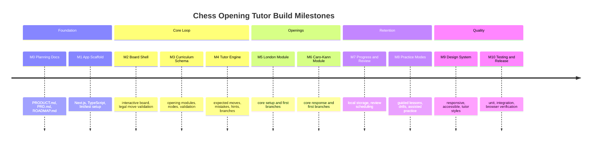
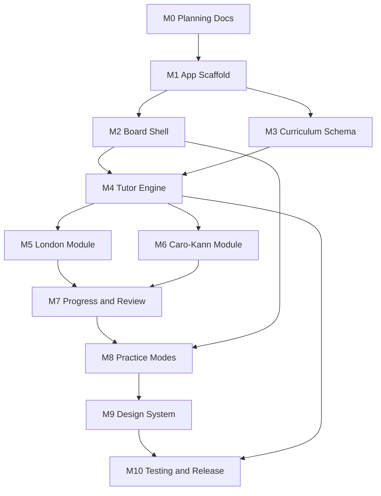
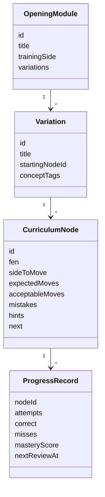
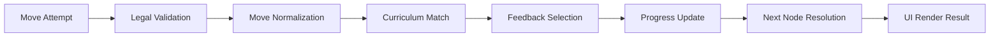
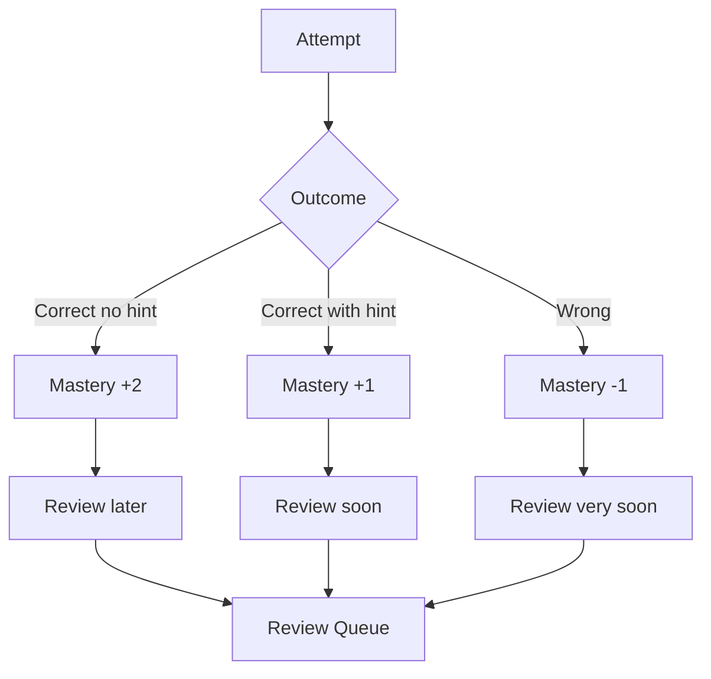
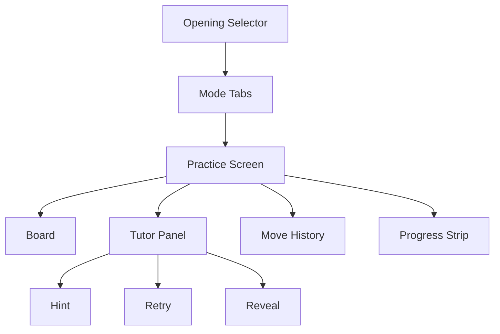

# Chess Opening Tutor Roadmap

Status: Draft v1  
Date: 2026-06-30  
Product: Local-first interactive tutor for the London System and Caro-Kann

## 1. Roadmap Summary

The project should be built in small vertical slices. The first milestone should prove the full learning loop with a tiny curriculum: board move, tutor feedback, progress update, and next position. After that, expand curriculum and polish the learning experience.

V1 target: personal app, free to run, local progress, no backend, no AI dependency.

## Progress Tracker

| Module | Status | Branch |
| --- | --- | --- |
| M0 Planning Docs | Complete | main |
| M1 App Scaffold | Complete | module/m1-app-scaffold |
| M2 Board Shell | Complete | module/m2-board-shell |
| M3 Curriculum Schema | Complete | module/m3-curriculum-schema |
| M4 Tutor Engine | Complete | module/m4-tutor-engine |
| M5 London Module | Complete | module/m5-london-module |
| M6 Caro-Kann Module | Complete | module/m6-caro-kann-module |
| M7 Progress and Review | Complete | module/m7-progress-review |
| M8 Practice Modes | Complete | module/m8-practice-modes |
| M9 Design System and UX Polish | In review | module/m9-design-system-polish |
| M10 Testing and Release | Not started | TBD |

## 2. Milestone Map



## 3. Dependency Graph



## 4. Module Breakdown

### M0: Planning Docs

Purpose:

- Establish the product strategy, PRD, and implementation roadmap.

Deliverables:

- `PRODUCT.md`
- `docs/PRD.md`
- `docs/ROADMAP.md`

Acceptance criteria:

- Documents agree that v1 is local-first, personal, free, and not AI-dependent.
- PRD includes system architecture and tutor behavior diagrams.
- Roadmap is sequenced by implementation dependency.

### M1: App Scaffold

Purpose:

- Create the technical foundation for the app.

Recommended implementation:

- Next.js with App Router.
- TypeScript in strict mode.
- ESLint and formatter.
- Test runner for domain logic.
- Basic app shell with practice route.

Dependencies:

- M0 complete.

Acceptance criteria:

- App starts locally.
- TypeScript check passes.
- Empty practice screen renders.
- Project has a clear source structure for UI, domain logic, data, and tests.

Suggested structure:

```text
src/
  app/
  components/
  domain/
    chess/
    curriculum/
    tutor/
    progress/
  data/
    openings/
  styles/
  tests/
```

### M2: Board Shell

Purpose:

- Make the app feel like chess practice from the beginning.

Recommended implementation:

- Add `chess.js`.
- Add `react-chessboard` or equivalent React board.
- Implement board orientation for White and Black training.
- Support drag-and-drop and keyboard move input.
- Display move history and current side to move.

Dependencies:

- M1 complete.

Acceptance criteria:

- Legal moves update the board.
- Illegal moves are rejected with clear feedback.
- Board can be oriented for London as White and Caro-Kann as Black.
- User can reset the position.
- Keyboard interaction is planned or implemented before design polish.

Verification:

- Test legal move validation through the chess adapter.
- Manually verify drag-and-drop on desktop and touch behavior on mobile viewport.
- Verify illegal moves do not corrupt board state.

### M3: Curriculum Schema

Purpose:

- Define the structured data that powers the tutor.

Recommended implementation:

- Create typed curriculum definitions for openings, variations, nodes, moves, mistakes, hints, and branches.
- Store starter curriculum as TypeScript data or JSON with TypeScript validation.
- Add a validation utility that checks references between nodes.

Dependencies:

- M1 complete.

Acceptance criteria:

- Curriculum can define London and Caro-Kann modules.
- Every node has a FEN, side to move, expected move, hints, and explanation.
- Branch references resolve to existing nodes.
- Mistake tags are consistent and testable.
- Invalid curriculum fails tests.

Core model:



### M4: Tutor Engine

Purpose:

- Turn moves into useful tutor feedback.

Recommended implementation:

- Build a pure domain function, such as `evaluateMove(context): TutorResult`.
- Normalize moves with `chess.js`.
- Compare user move against expected moves, acceptable alternatives, mistakes, and transpositions.
- Return structured feedback for the UI to render.

Dependencies:

- M2 complete.
- M3 complete.

Acceptance criteria:

- Correct moves advance the lesson.
- Known mistakes trigger specific explanations.
- Illegal moves are handled before tutor evaluation.
- Hints progress from concept to explicit move.
- Unknown legal moves receive principle-based feedback.
- Tutor result includes message, feedback type, highlights, retry state, and progress update.

Tutor engine pipeline:



### M5: London Module

Purpose:

- Teach the London System as White through setup, branches, and common mistakes.

Dependencies:

- M4 complete.

Minimum lessons:

- Core setup against `...d5` and `...Nf6`.
- Early `Bf4` move order.
- King's Indian setup with `...g6`.
- Early `...c5` pressure.
- Early/symmetric `...Bf5`.

Acceptance criteria:

- User can complete a guided London core setup lesson.
- User can drill at least 10 London positions.
- Tutor explains Bf4, e3, Bd3, Nbd2, c3, castling, and Ne5 plans.
- At least 5 common London mistakes have specific tutor messages.
- Transpositions between common London move orders are recognized where practical.

Verification:

- Curriculum validation passes.
- Manual board walkthrough confirms each branch reaches the intended position.
- Beginner explanations avoid unexplained advanced jargon.

### M6: Caro-Kann Module

Purpose:

- Teach the Caro-Kann as Black through White's common third-move choices.

Dependencies:

- M4 complete.

Minimum lessons:

- Core start: `1.e4 c6 2.d4 d5`.
- Advance Variation.
- Exchange Variation.
- Classical with `3.Nc3`.
- Modern/Classical with `3.Nd2`.
- Fantasy Variation.
- Panov-Botvinnik entry point.

Acceptance criteria:

- User can complete a guided Caro-Kann core lesson.
- User can drill at least 12 Caro-Kann positions.
- Tutor explains ...c6, ...d5, ...Bf5, ...e6, ...c5, and development priorities.
- At least 6 common Caro-Kann mistakes have specific tutor messages.
- Board orientation defaults to Black for Caro-Kann practice.

Verification:

- Curriculum validation passes.
- Manual board walkthrough confirms each branch.
- Tutor catches the "play ...e6 before ...Bf5 in the Advance" beginner mistake.

### M7: Progress And Review

Purpose:

- Make learning stick by resurfacing missed positions.

Recommended implementation:

- Store progress records in localStorage.
- Use a simple mastery score and `nextReviewAt`.
- Record attempts, misses, hint usage, and correct-first-try results.
- Provide a review queue view.

Dependencies:

- M5 and M6 have starter curriculum.

Acceptance criteria:

- Missed positions enter review.
- Correct positions are scheduled farther out.
- Hint usage affects mastery less than unaided correct answers.
- Progress survives browser refresh.
- User can clear/reset local progress.

Review schedule:



### M8: Practice Modes

Purpose:

- Shape the curriculum into distinct learning workflows.

Dependencies:

- M7 complete.

Modes:

- Guided lesson: teaches concept and move.
- Drill: tests recall with minimal explanation.
- Assisted practice: app plays opponent replies while tutor assists.
- Review: focuses on due missed positions.

Acceptance criteria:

- User can switch modes from a clear navigation surface.
- Each mode changes tutor verbosity appropriately.
- Assisted practice can choose opponent replies from curriculum branches.
- Review mode pulls due progress records.
- Mode changes do not lose current board state unless the user confirms reset.

### M9: Design System And UX Polish

Purpose:

- Make the app feel like a focused practice room rather than a database.

Dependencies:

- M8 complete enough to exercise real flows.

Design requirements:

- Board-first layout.
- Tutor panel with concise feedback.
- Selectable tutor style.
- Clear hint/retry/reveal controls.
- Responsive desktop and mobile layouts.
- WCAG AA contrast.
- Reduced-motion support.
- Stable dimensions for board, move history, controls, and tutor feedback.

Acceptance criteria:

- Main practice screen works at mobile, tablet, and desktop sizes.
- Text never overflows buttons, panels, or cards.
- Board remains usable on small screens.
- Keyboard focus order is logical.
- Color is not the only feedback signal.
- Tutor style can be changed and persists locally.

Recommended UI map:



### M10: Testing And Release

Purpose:

- Verify that the product teaches correctly and does not break the learning loop.

Dependencies:

- M9 complete.

Test layers:

- Unit tests for chess adapter.
- Unit tests for tutor engine.
- Curriculum validation tests.
- Progress scheduling tests.
- Component tests for tutor panel states.
- Browser tests for core practice flow.
- Accessibility checks for keyboard and contrast.

Acceptance criteria:

- Test suite passes.
- Build passes.
- Manual smoke test covers London and Caro-Kann.
- App can be run locally with documented commands.
- Optional free hosting deployment is documented.

Release checklist:

- Open London guided lesson, play correct and incorrect moves.
- Open Caro-Kann guided lesson, play correct and incorrect moves.
- Confirm hints progress correctly.
- Confirm review queue updates after a miss.
- Refresh browser and confirm progress remains.
- Test keyboard board controls.
- Test mobile viewport.
- Test reduced-motion mode.

## 5. Implementation Order

1. Create app scaffold.
2. Add board and chess validation.
3. Define curriculum schema.
4. Build tutor engine with one London node and one Caro-Kann node.
5. Wire one complete vertical slice: board move to tutor result to progress update.
6. Expand London curriculum.
7. Expand Caro-Kann curriculum.
8. Add review scheduling.
9. Add practice modes.
10. Polish design and accessibility.
11. Add full test coverage and release documentation.

## 6. Key Engineering Practices

- Keep domain logic pure and testable.
- Keep UI components focused on rendering state, not deciding chess truth.
- Validate curriculum data in tests.
- Use typed IDs and unions for openings, modes, feedback types, and tutor styles.
- Avoid hardcoding move logic inside React components.
- Keep local storage access behind a small persistence service.
- Treat AI as an optional future adapter, not a dependency of tutor correctness.

## 7. Definition Of Done For V1

V1 is done when:

- A user can practice the London System as White.
- A user can practice the Caro-Kann as Black.
- The app validates legal moves.
- The tutor gives useful feedback for correct moves, mistakes, hints, and unknown legal moves.
- Missed positions return in review.
- Progress persists locally.
- Tutor style is selectable.
- The app is responsive and accessible enough for repeated use.
- No backend, paid service, or AI API is required.
